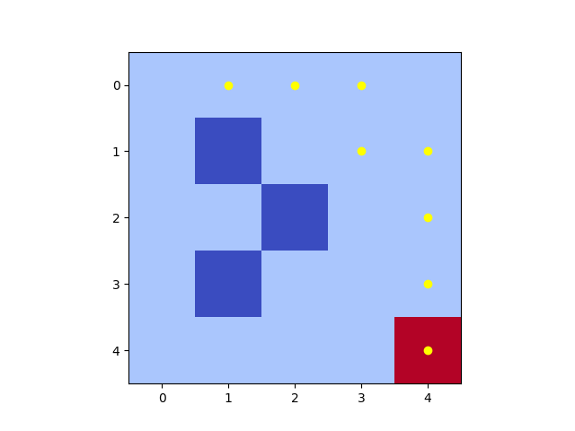

#  Q-Learning Maze Solver | Labirent Çözücü

This project trains an agent with **Q-Learning** to solve a maze.  
Bu proje, **Q-Learning** kullanarak bir ajanın labirentte hedefe ulaşmasını öğretir.

---

##  Installation | Kurulum
```bash
git clone https://github.com/yourusername/qlearning-maze.git
cd qlearning-maze
pip install -r requirements.txt


